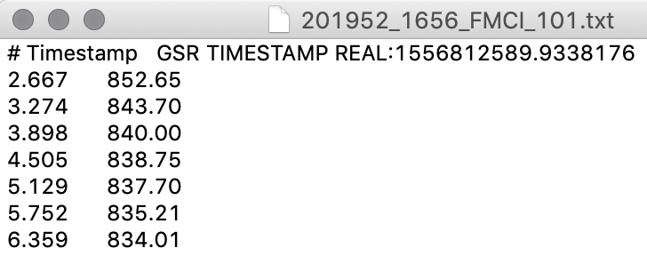
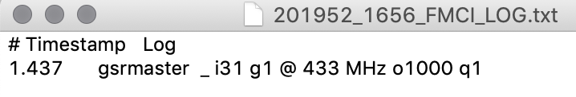

# Example Data Logger App in Python for the FMCI Wearable

The data logger app example provides the needed tools to interact with the FMCI device using Python.

## Dependencies
* [Python >2.7](https://www.python.org/downloads/) or [Anaconda](https://www.continuum.io/downloads) or [Python 3.4](https://www.python.org/downloads/)
* [NumPy](https://pypi.python.org/pypi/numpy)
* [pySerial](https://pypi.python.org/pypi/pyserial)

Install Dependencies
* **NumPy**
~~~
pip install numpy
~~~

* **pySerial**
~~~
pip install pyserial
~~~

## Installation
Installation can be easily done with the `Clone or Download` button above:

```bash
$ git clone https://github.com/PIA-Group/python-fmci-datalogger-example.git
```
## Example

Specify the USB input Port or the directory to save the data files.
~~~python

python /path/to/FMCIlogger.py -i Device_USB_PORT -o save/file/dir

~~~

Or simply run the program in default mode.

~~~python

python /path/to/FMCIlogger.py

~~~

Example of the data file
<p align="center">
  
</p>

Example of the logger file
<p align="center">
  
</p>

## Acknowledge
This work has been partially funded by the Xinhua Net Future Media Convergence Institute under project S-0003-LX-18.
